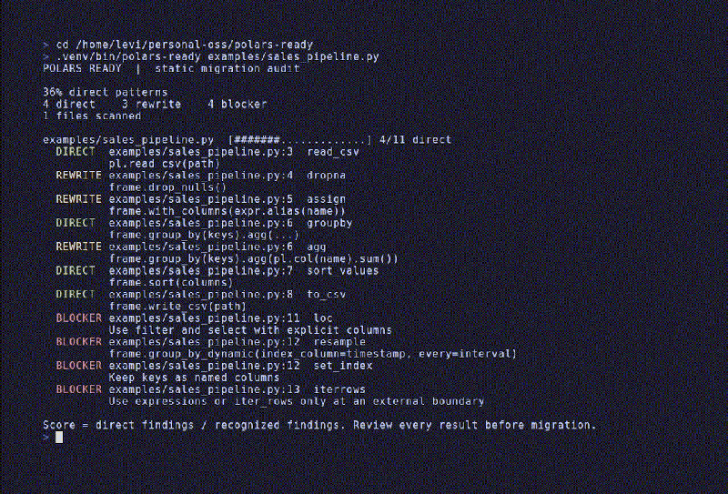

# polars-ready

**See which Pandas calls need review before you move a Python pipeline to Polars.**



Run a read-only audit without adding a dependency to your project:

```sh
uvx --from git+https://github.com/Arthur031221/polars-ready polars-ready path/to/pipeline.py
```

A five-line example:

```python
import pandas as pd
sales = pd.read_csv("sales.csv")
sales = sales.dropna(subset=["amount"])
monthly = sales.set_index("date").resample("M").sum()
monthly.to_csv("monthly.csv")
```

The report points to `set_index` and `resample` as migration blockers, with explicit column and dynamic grouping suggestions. It also reports direct and rewrite patterns. The percentage is the share of recognized calls classified as direct, **not** a prediction that a migration will preserve results or save time.

## Why scan first?

Polars has different index, null, expression, and ordering behavior. Replacing imports without identifying those dependencies can change output. This tool reads Python syntax trees and never imports or runs the target code. It reports the location, rule ID, confidence, and a suggested Polars idiom for each match.

```sh
polars-ready path/to/source-directory
polars-ready analysis.ipynb --json > audit.json
polars-ready path/to/source-directory --fail-on-blocker
```

`--fail-on-blocker` exits with status 2 when a blocker is found. Parse errors exit with status 1. JSON output has a version field for CI consumers. Direct installations work with `pip install git+https://github.com/Arthur031221/polars-ready`.

The first release recognizes common Pandas constructors and I/O, group operations, sorting, missing data, reshaping, index use, row callbacks, categorical access, and timezone methods. [The rule catalog](src/polars_ready/rules.py) lists every supported ID and its hint. The scanner follows common Pandas import aliases and local variables assigned from recognized constructors or calls. It can miss dynamically imported Pandas, values passed across function boundaries, and aliases hidden in containers. It can report an unrelated method on a variable whose name is reused. Notebook code cells that start with a shell or IPython magic are skipped; other syntax errors are reported.

Run the reproducible fixture with `polars-ready examples/sales_pipeline.py`. The fixture is source text for scanning and needs no sales.csv file.

## Development

```sh
python -m pip install -e .
python -m unittest discover -s tests -v
```

MIT licensed. See [CONTRIBUTING.md](CONTRIBUTING.md).
